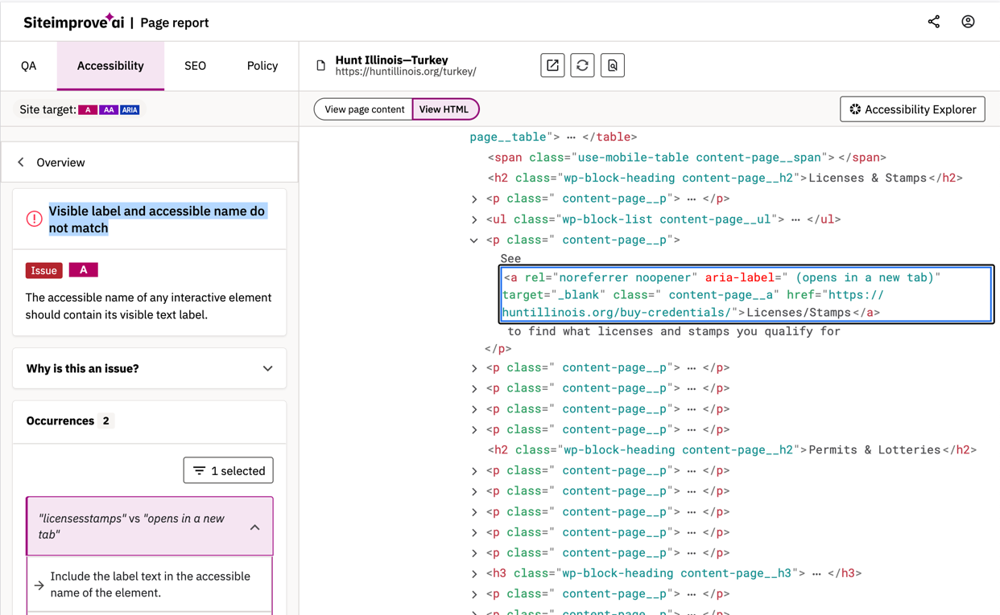
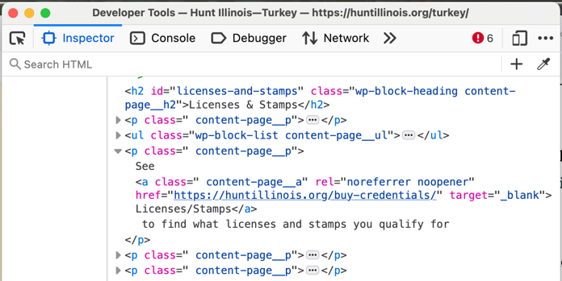
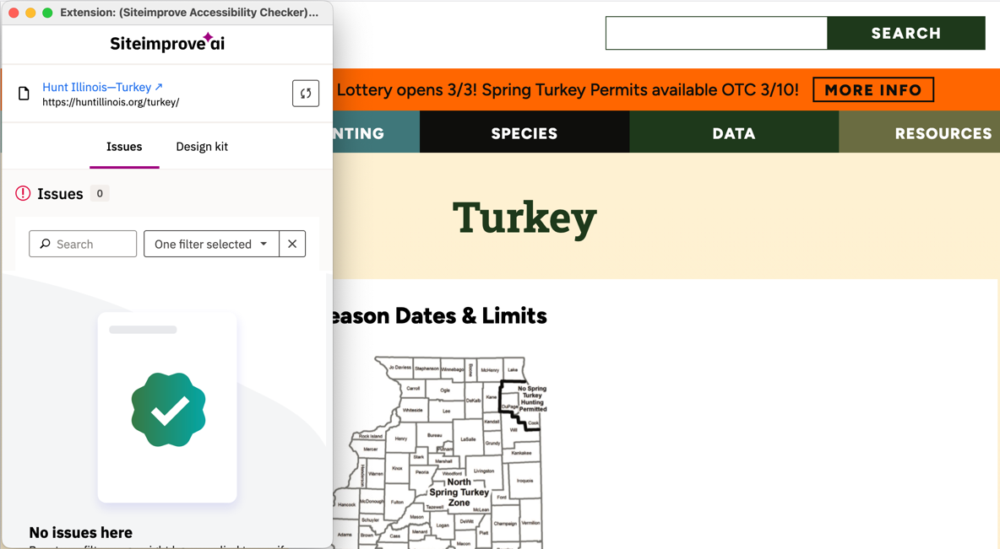

# Accessibility Report for IDNR Websites Maintained by NGRREC

National Great Rivers Research and Education Center (NGRREC) develops and maintains several websites for IDNR Division of Wildlife. 

Notes:

ADA Title II Web Accessibility Rule, finalized by the Department of Justice in April 2024. It updates Title II of the Americans with Disabilities Act to explicitly require state and local governments to meet WCAG 2.1 Level AA for their websites and mobile apps.
The compliance deadlines are staggered by population size: April 26, 2026 for entities serving 50,000+ people, and April 26, 2027 for smaller entities. 

Regarding federally funded technologies:

Section 508 of the Rehabilitation Act is the origin. It's been around since 1998 and requires federal agencies to make their information and communications technology accessible. The 2017 "Section 508 Refresh" updated the technical standard to explicitly reference WCAG 2.0 Level AA — that's the current legal requirement, not 2.1.
Section 504 of the Rehabilitation Act extends accessibility requirements to any organization that receives federal financial assistance — universities, hospitals, state agencies, nonprofits with federal grants, etc. It doesn't specify a WCAG version directly, but compliance is generally interpreted through the same WCAG 2.0 AA lens that Section 508 established.
So the requirement chain is: federal funding → Section 504 obligation → accessibility standards interpreted as WCAG 2.0 AA (per the Section 508 Refresh).
The 2.1 part is where practice has gotten ahead of the law. WCAG 2.1 is a superset of 2.0 (everything in 2.0 is in 2.1, plus additional criteria mainly around mobile and cognitive accessibility). Most organizations now target 2.1 AA as best practice, and the new ADA Title II rule we discussed earlier explicitly requires 2.1 AA. So while the Section 508 baseline is technically still 2.0, the practical expectation — and the direction enforcement is moving — is 2.1 AA.

## 2wav Advocacy for Accessibility and Practice

We have been active in web accessibility (A11Y) since before WCAG guidelines were required. We had employees reliant on assistive technologies as early as 2014, and we have actively advocated for A11Y and published on the topic, including a 2017 technical article on making accessible [geo-spatial applications](https://2wav.com/blogPage/making-mapbox-popups-accessible-2), and a 2023 [guide for developers](https://2wav.com/blogPage/an-interent-for-all) to evaluate and adjust web applications using pioneer tools created by the University of Illinois. 

## University of Illinois Accessibility

The University of Illinois, where we have many roots, was a pioneer in both physical and web accessibility. U of I helped write the WCAG guidelines and created the first widely used tools including:
* the [Functional Accessibility Evaluator (FAE)](https://accessibleit.disability.illinois.edu/tools/fae)
* it's companion tool the [AInspector for Firefox](https://addons.mozilla.org/en-US/firefox/addon/ainspector-wcag/)
* the [Open A11Y Library](https://opena11y.github.io/evaluation-library/), which these and other tools are based.

These are the primary tools used to assess U of I and other academic websites, which we have largely relied on to assess our applications.

## Siteimprove 

Siteimprove appears to provide three tools for A11Y evaluation:
* Online commercial site scanning tools available only to customer accounts. 
* A free browser extension for evaluating individual web pages.
* An open source evaluation library named [Siteimprove Alfa](https://github.com/Siteimprove/alfa), apparently developed under a grant from the European Union (and perhaps the reason it is open source). It seems likely that this is the code underlying the Siteimprove tools, but we haven't found any definitive statements from Siteimprove. 

## Siteimprove Online Scanner & Browser Extension

The Siteimprove online site scanner appears to be the primary evaluation tool being used by IDNR. We have no direct access to this tool, and have been instructed to spot-check our 2000+ pages using the free browser extension. Over the last year we invested considerable effort to compare and find differences between the Siteimprove results and the U of I tools we previously used. Most of these differences are minor ideosyncracratic differences which we were able to adjust for. However, manually spot-checking all 2000+ pages is not practical, hence our repeated requests to be given access to the whole-site online scanner.   

### Siteimprove Scanner Difficulties

Our limited access to reports from the Siteimprove online scanner indicate that the scanner does not let web pages fully form before evaluating the content. Many modern web applications dynamically construct or enhance the page in the browser itself after raw content from the webserver has been loaded. The rendered page is what human users and assistive technologies interact with. This practice is commonly called _hydration_, and it is present in most modern websites built with current generation frameworks such as Next, Nuxt, Angular, Meteor, or Ember. 

The Siteimprove reports sometimes include temporary access to an inspector which shows the content which was evaluated by the tool. The inspector clearly shows page content before hydration by the browser, and therefore finds issues which are not present in the real web page. 

### Simple Example
The Siteimprove online tool returns a report for an error titled: "Visible label and acessible name do not match". The Siteimprove inspector for one instance of this error shows HTML which includes an improper **aria-label** attribute (here colored in red for emphasis):

The _actual_ HTML for this page as rendered in a browser does not contain this attribute (shown here in a browser inspector):

The [Hunt Illinois Turkey](https://huntillinois.org/turkey/) page passes evaluation by both the Siteimprove browser extension and the [Siteimprove Alfa](https://github.com/Siteimprove/alfa) accessibility evaluator software. It does not pass the online scanner because the actual page content is not being evaluated. 

## A Site Scanner Using Siteimprove's Alfa Evaluator

