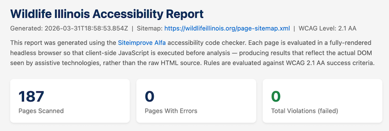
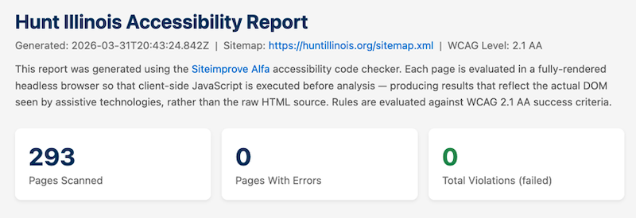
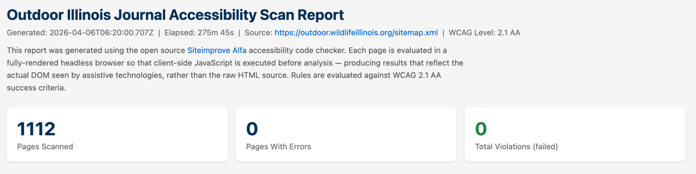
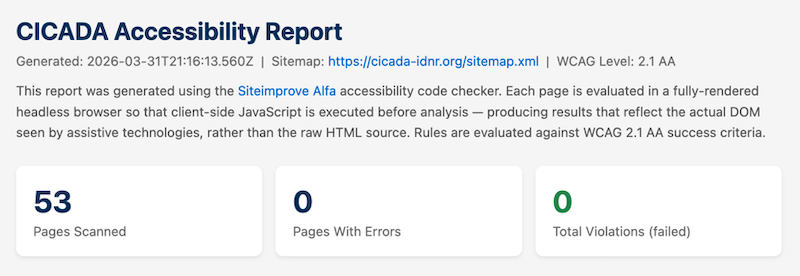
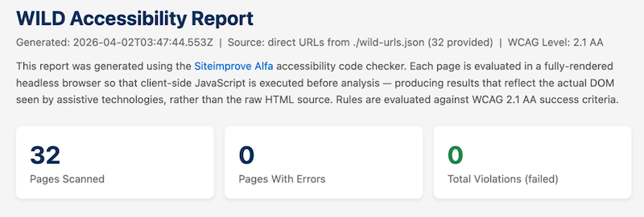

# Accessibility Report

[TOC]

2wav has completed an Accessibility (A11Y) evaluation and update on the websites developed by National Great Rivers Research and Education Center (NGRREC) for IDNR Division of Wildlife, including:

* [Wildlife Illinois](https://wildlifeillinois.org)
* [Hunt Illinois](https://huntillinois.org)
* [Outdoor Illinois Journal](https://outdoor.wildlifeillinois.org)
* [CICADA](https://cicada-idnr.org)
* [WILD](https://wild.wildlifeillinois.org) — a multi-purpose portal for NARP, NWCO, Deer Removal Permits, and (soon) hunting site information.

## Accessibility Regulations

Web accessibility is receiving significant attention ahead of the April 26, 2026 deadline set by the ADA Title II Web Accessibility Rule. Finalized by the Department of Justice in April 2024, the rule explicitly requires state and local governments to meet WCAG 2.1 Level AA for their websites and mobile applications. The deadline applies to entities serving 50,000 or more people; smaller entities have until April 26, 2027.

For many organizations this is a new obligation. For NGRREC and its IDNR websites, it is not. Because our projects receive federal financial assistance, accessibility has been a legal requirement for years. Section 504 of the Rehabilitation Act extends accessibility obligations to any organization receiving federal funding, and compliance is interpreted through the standard established by the 2017 Section 508 Refresh: WCAG 2.0 Level AA.

WCAG 2.1 is a strict superset of WCAG 2.0 — every criterion in 2.0 is preserved in 2.1, with additional criteria addressing mobile usability and cognitive accessibility. A site that fully meets WCAG 2.0 AA is already close to 2.1 AA compliance. We have been using 2.1 AA for our own assessments for several years. For our sites, the the current deadline has been an opportunity to tidy up across the board and ensure the upgrade to the newer standard.

## 2wav Advocacy for Accessibility and Practice

We have been active in web accessibility (A11Y) since before it was required. We had employees reliant on assistive technologies as early as 2014, and we have actively advocated for A11Y and published on the topic, including a 2017 technical article on making accessible [geo-spatial applications](https://2wav.com/blogPage/making-mapbox-popups-accessible-2), and a 2023 [guide for developers](https://2wav.com/blogPage/an-interent-for-all) using the University of Illinois A11Y tools. 

## University of Illinois Accessibility

The University of Illinois, where we have many roots, was a pioneer in both physical and web accessibility. U of I helped write the WCAG guidelines and created some of the first widely used A11Y tools including:
* the [Functional Accessibility Evaluator (FAE)](https://accessibleit.disability.illinois.edu/tools/fae)
* it's companion tool the [AInspector for Firefox](https://addons.mozilla.org/en-US/firefox/addon/ainspector-wcag/)
* the [Open A11Y Library](https://opena11y.github.io/evaluation-library/), which these and other tools are based.

These are the primary tools used by the U of I, which we have largely relied on in the past.

## Siteimprove 

We know of three Siteimprove tools for A11Y evaluation:
* Online commercial site scanning tools only available to customer accounts. 
* A free browser extension for evaluating individual web pages.
* An open source evaluation library named [Siteimprove Alfa](https://github.com/Siteimprove/alfa), developed under a grant from the European Union. Notes in the code indicate that this is used by the Siteimprove browser extension, and likely the commerial tools. This library is under active development and is updated frequently. It is likely more up-to-date than either the browser extension or the online scanner.

We have compared results from these tools:
* The browser extension and the online scanner generally return very similar results, _other than violations incorrectly reported by the scanner (described below)_.
* The [Siteimprove Alfa](https://github.com/Siteimprove/alfa) library is slightly more strict. It finds a few violations that are not reported by the extension or online scanner. This is probably due to its frequent updates.
* The browser extension and online scanner misidentify a few issues, for example, miscalculating the visible size of some elements. _We changed the sites to accommodate these idiosycrasies._ 

## Siteimprove Online Scanner & Browser Extension

The Siteimprove online site scanner appears to be the primary evaluation tool being used by IDNR. We have no direct access to this tool, and were advised to spot-check our pages using the free browser extension. Using the extension, we found many differences between the Siteimprove results and our usual tools. However, manually spot-checking all 2000+ pages is not practical, hence our repeated requests for access to the whole-site online scanner.

### Siteimprove Scanner Difficulties

Reports we received from the Siteimprove online scan indicate that the scanner does not let web pages fully form before evaluating the content. Many modern web applications dynamically construct or enhance the page in the browser itself after raw content from the webserver has been loaded. The rendered page is what human users and assistive technologies interact with. This practice is commonly called _hydration_, and it is present in most modern websites built with current generation frameworks such as Next, Nuxt, Angular, Meteor, or Ember. 

Some Siteimprove reports include temporary access to an inspector which shows the exact content evaluated by the tool. The inspector clearly shows page content before hydration by the browser, and therefore finds issues which are not present in the real web page. 

### Simple Example of a Misidentified Violation
The Siteimprove report for Hunt Illinois shows an error titled: "Visible label and accessible name do not match". The Siteimprove inspector for one instance of this error on the [Hunt Illinois Turkey](https://huntillinois.org/turkey/) page shows HTML which includes an improper **aria-label** attribute (colored in red for emphasis):

The _actual_ HTML for this page as rendered in a browser does _not_ contain this attribute (shown here in a browser inspector):

The [Hunt Illinois Turkey](https://huntillinois.org/turkey/) page passes evaluation by both the Siteimprove browser extension and [Siteimprove Alfa](https://github.com/Siteimprove/alfa). It fails the online scanner because the actual page content is not being evaluated. 

## A Site Scanner Using Siteimprove's Alfa Evaluator

Manually spot-checking individual pages with a browser extension is not a practical path to compliance for a sites totalling over 2,000 pages. We needed a tool that could evaluate every page — using the same Siteimprove Alfa evaluation engine — against a fully rendered page.

No such tool existed, so we built one.

The tool, [alfa-a11y-scan](https://github.com/anderson-2wav/alfa-a11y-scan), is an open-source command-line utility developed by 2wav. It accepts an XML sitemap URL or a list of URLs, fetches each page in a headless Chromium browser (via Microsoft Playwright), waits for JavaScript to execute and the Document Object Model (DOM) to fully hydrate, then passes the rendered document to the Siteimprove Alfa evaluation library. Results are aggregated into structured reports in CSV, Excel, JSON, or HTML format.

The tool is released under the [AGPL-3.0](https://www.gnu.org/licenses/agpl-3.0.en.html) open-source license. It was developed by 2wav with only our own resources, for use by our clients and other organizations facing the similar challenges with the April 2026 deadline.

## Site Reports
All sites have been evaluated using our scanner with no violations. Each report is available to download. A screenshot of the summary is included for each site.

### Wildlife Illinois

* 187 Pages
* 0 Violations
* [FULL REPORT](https://wildlifeillinois.org/wp-content/uploads/2026/04/wild-a11y-report.html)

### Hunt Illinois

* 293 Pages
* 0 Violations
* [FULL REPORT](https://wildlifeillinois.org/wp-content/uploads/2026/04/huntillinois-a11y-report.html)

### Outdoor Illinois Journal

* 1112 Pages
* 0 Violations
* [FULL REPORT](https://wildlifeillinois.org/wp-content/uploads/2026/04/oij-a11y-report.html)

### CICADA

* 53 Pages
* 0 Violations
* [FULL REPORT](https://wildlifeillinois.org/wp-content/uploads/2026/04/cicada-a11y-report.html)

### WILD

* 32 Pages
* 0 Violations
* [FULL REPORT](https://wildlifeillinois.org/wp-content/uploads/2026/04/wild-a11y-report.html)

